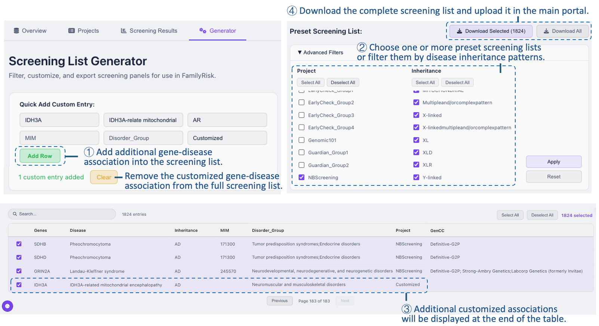

The FamilyRisk database is a unified resource for carrier and newborn screening. It could be found under **"Database"** on the homepage.

### Overview
The database information is summarized in the **"Overview"**. It integrates 3,112 curated gene–disease associations derived from seven leading NBSeq projects and two ACMG recommendations, collectively covering 15 disease ontologies. 

### Projects
Each of the projects collected in this database could be reviewed in the **"Projects"**. By clicking the project name/logo, project information, filtering criteria for pathogenic variants, clinical returned results, and quick links to the official website and relevant publications can be referred to. More importantly, the detailed screening list of each project is presented as well. 

### Screening Results 
The clinical returned results of five newborn sequencing projects are summarized in the **"Screening Results"**. Notably, only BabySeq and EarlyCheck disclosed the screen-positive carrier status. 

### Generator
FamilyRisk Database offers the Screening List Generator, enabling users to customize gene-disease associations outside the collections. This tool displays all curated associations collected in the database, with the corresponding disease inheritance modes, OMIM identifiers, disease ontologies, originating projects, and GenCC classifications and submitters. Users could select subgroups of the screening lists and disease inheritance modes via “Advanced Filters”. Additional gene-disease associations could be manually added into the full list via the “Quick Add Custom Entry” function by specifying the gene symbol, disease name, and other relevant details. All customized entries will be added to the end of the main table, while the wrong ones could be easily cleared. Eventually, the full list or selected associations could be downloaded locally and applied to the downstream genomic data analysis in the main portal. 

